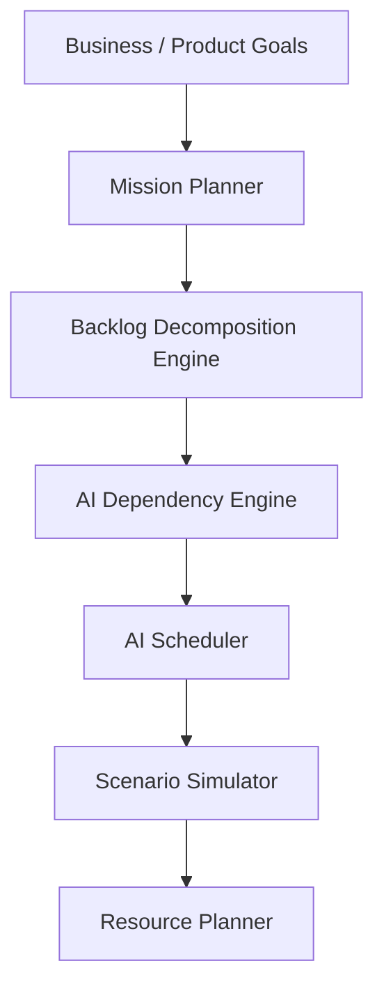

# Autonomous Planning Engine Documentation

The **Autonomous Planning Engine** is a core component of the AI ProductOS platform. It bridges the gap between high-level business goals and execution-level tasks, empowering product teams to decompose product visions, simulate execution scenarios, align resources, and schedule work items.

---

## 1. Core Architecture

The architecture consists of a layered execution system:

All services are located in the FastAPI backend under `backend/app/services/planning/` and exposed via endpoints under `/api/v1/planning/`.

---

## 2. Goal Management System

The **Goal Management System** allows organizations to define, tracking, and delete workspace-specific goals.

### Supported Goal Types
*   **Business Goals**: High-level corporate growth, revenue, and expansion metrics.
*   **Product Goals**: Feature adoption, active usage, retention, and launch targets.
*   **Technical Goals**: Architecture, latency, database optimizations, uptime, and scaling.
*   **Sprint Goals**: Specific sprint-level commitments.
*   **Release Goals**: Major launch boundaries.

### Automatic Progress Tracking
Goals calculate progress metrics dynamically:
*   `progress`: Evaluated based on associated mission completion states or manually configured key results (0% - 100%).

---

## 3. Mission Planner & Execution Maps

The **Mission Planner** (`MissionPlanner`) takes multiple workspace goals and synthesizes them into a unified **Mission**.

### Structure of a Mission Plan
*   **Objectives**: Specific quantitative targets (e.g., "Achieve <100ms API response time").
*   **Milestones**: Timeline boundaries with estimated delivery weeks.
*   **Deliverables**: Direct tangible artifacts (e.g., "Encrypted PostgreSQL schema").
*   **Execution Steps**: Sequence of actions recommended to complete the mission.

---

## 4. Agile Backlog Decomposition Engine

The **Planning Engine** decomposes a text-based **Product Vision** into a nested, hierarchical backlog of agile items:

1.  **Epic**: Broad product capability.
2.  **Feature**: Tangible module or flow.
3.  **User Story**: User-centric value description.
4.  **Task**: Direct developer action.
5.  **Subtask**: Granular step.

### Reusable Industry Templates
To bootstrap workspaces instantly, the engine contains built-in templates:
*   **SaaS App**: Auth, subscription billing, dashboard, settings.
*   **AI Product**: LLM integrations, caching, prompt versioning, agent orchestrator.
*   **Healthcare App**: Patient registration, doctor matching, encrypted EHR files.
*   *Other templates include CRM, ERP, Finance, Education, and Mobile Apps.*

---

## 5. AI Scheduler & Dependency Graph

### AI Dependency Engine
Scans the current backlog of tasks to detect logical and technical dependencies:
*   **Prerequisite Blocks**: A task must be completed before another starts.
*   **API & Database Blockers**: Schema or integration requirements that are prerequisites.
*   **Infrastructure Dependencies**: Deployment/hosting requirements.

### Kahn's Topological Sort Scheduler
The AI Scheduler arranges the tasks into an optimized timeline:
1.  Loads all active planning items and dependencies.
2.  Applies **Kahn's algorithm** to resolve task ordering.
3.  Computes start and end dates based on task priority, estimation hours, and team capacity.
4.  Updates database records with `scheduled_start` and `scheduled_end` timestamps.

---

## 6. Scenario Simulator & Resource Planner

### Scenario Simulator
Runs Monte Carlo simulations on project timelines based on historical delay rates and blocker risks:
*   **Best Case (Optimistic)**: Minimal delay, maximum speed.
*   **Average Case (Expected)**: Standard operational delay.
*   **Worst Case (Pessimistic)**: High delay risk, critical path bottleneck identification.
*   **Budget Impact**: Cost bounds based on developer hourly rates.

### Resource Planner
Estimates execution requirements for the backlog:
*   **Headcount**: Required headcount for Frontend, Backend, QA, and Design.
*   **Cloud Infrastructure Cost**: Estimated monthly host/database costs.
*   **AI API Budgets**: Estimated LLM token/credit costs.

---

## 7. Context Compression

To operate within strict LLM token constraints, the context compressor extracts semantic metadata and shortens:
*   Long text logs, documents, and transcripts.
*   Active agent conversation threads.

---

## 8. Dashboard UI

The Planning Dashboard is available under `/dashboard/planning`. It contains five modular tabs:
1.  **Goals Board & Mission Planner**: CRUD workspace goals, select multiple goals, and generate an AI Mission Plan.
2.  **Agile Backlog & Templates**: Decompose product visions, apply industry-specific templates, and run the scheduler.
3.  **Dependencies**: Discover task-to-task prerequisites.
4.  **Scenario Simulations**: Run optimistic vs pessimistic cost/timeline models.
5.  **Context Compressor**: Clean and compress text datasets.
